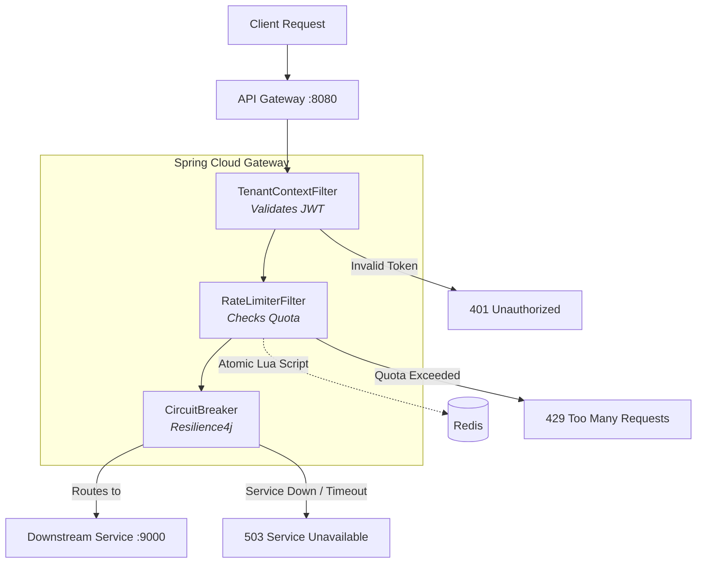

# 🚀 Multi-Tenant Reactive API Gateway

A production-grade, non-blocking API Gateway built with **Spring Cloud Gateway** and **WebFlux**. This project acts as a central ingress point for downstream microservices, providing JWT-based authentication, distributed sliding-window rate limiting via Redis, and cascading failure protection via Resilience4j circuit breakers.

## 🚀 Technical Highlights & Features

* **Reactive & Non-Blocking Architecture:** Built on **Spring Cloud Gateway** and **WebFlux** (Netty) to handle massive concurrency without thread exhaustion, sustaining **4,800+ RPS** in benchmark tests.
* **Distributed Rate Limiting:** Implemented a multi-tenant Sliding Window Log algorithm using atomic **Redis Lua scripts**, strictly enforcing API quotas (`FREE`, `PRO`, `ENTERPRISE`) with zero race conditions.
* **Cascading Failure Protection:** Integrated **Resilience4j** Circuit Breakers to detect lagging downstream services, instantly serving `503` fallbacks to protect the gateway from resource exhaustion.
* **Stateless JWT Security:** Secured via HMAC-SHA signed Bearer tokens. A custom `GlobalFilter` cryptographically validates tokens and injects tenant identity into the reactive exchange context.
* **Fail-Open Design:** Engineered the Redis connection with reactive `onErrorResume` fallbacks. If the rate-limiting database goes down, the gateway gracefully fails open to keep mission-critical traffic flowing.
* **High-Fidelity Testing (98% Coverage):** Achieved **98% instruction coverage** (JaCoCo) utilizing **JUnit5** and **Mockito** for unit tests, and **Testcontainers** to validate Lua scripts against a real Dockerized Redis instance.
* **Full-Stack DevOps & Cloud:**
    * Fully containerized using a multi-stage `Dockerfile` and `docker-compose`.
    * Monitored in real-time with **Micrometer, Prometheus, and Grafana**.
    * Automated via **GitHub Actions** (CI pipeline for build, test, and lint).
    * Deployed live to an **AWS EC2** instance.

## ✨ Key Features

* **Reactive & Non-Blocking**: Built on Spring WebFlux and Netty to handle thousands of concurrent connections without thread exhaustion.
* **Multi-Tenant Rate Limiting**: Uses a distributed **Sliding Window Log** algorithm via an atomic Redis Lua script. Automatically enforces specific quotas based on tenant tiers (`FREE`: 60/min, `PRO`: 500/min, `ENTERPRISE`: 5000/min).
* **JWT Authentication**: Cryptographically verifies Bearer tokens (HMAC-SHA) and extracts tenant identity and pricing tier into the request context.
* **Resilience & Circuit Breaking**: Protects downstream services from traffic spikes using Resilience4j. If a backend struggles, the gateway fails fast with a `503 Service Unavailable` rather than holding connections open.
* **Fail-Open Architecture**: If the Redis cluster goes down, the gateway gracefully falls back to a fail-open state, allowing traffic through rather than causing a total platform outage.
* **Full-Stack Observability**: Fully instrumented with Micrometer, exposing metrics to a Prometheus + Grafana stack via Docker Compose.

---

## 🏗️ Architecture



---

## 📊 Performance Benchmarks

The gateway was aggressively load-tested using **k6**, simulating **1,000 concurrent virtual users** against a local Docker environment.

* **Throughput:** Sustained **~4,800 Requests Per Second (RPS)** (processing over 1,000,000 requests in 3.5 minutes).
* **Latency:** Maintained a **p95 latency of <20ms** across the entire 1M+ request run.
* **Mathematical Precision:** Under the `PRO` tier limit (500 requests/minute), the sliding window perfectly enforced the quota over 4 minute boundaries, allowing exactly ~2,000 requests through to the backend while instantly rejecting 1,000,000+ excess requests with `429` status codes.
* **Circuit Breaker Validation:** Under the `ENTERPRISE` tier (5000 requests/minute), the massive allowable throughput intentionally overwhelmed the downstream mock service. The gateway successfully detected backend lag, tripped the circuit breaker, and served `503` fallbacks for 17,000+ requests, preventing a gateway crash and keeping latency under 17ms.

---

## 🛠️ Technology Stack

* **Language**: Java 21
* **Framework**: Spring Boot 3.5.x, Spring Cloud Gateway (WebFlux)
* **Datastore**: Redis (Reactive Lettuce Driver)
* **Security**: JJWT (Java JWT)
* **Resilience**: Resilience4j (Reactor integration)
* **Observability**: Micrometer, Prometheus, Grafana
* **Testing / Infrastructure**: k6, Docker, Docker Compose, Node.js (Mock Service)

---

## 🚀 How to Run Locally

### Prerequisites
* Docker & Docker Compose
* Java 21 (if compiling locally outside Docker)

### 1. Start the Stack
Bring up the entire 5-container ecosystem (Gateway, Redis, Mock Service, Prometheus, Grafana) with one command:
```bash
docker compose up --build
```

### 2. Generate a Test Token
Generate a valid JWT for the `FREE`, `PRO`, or `ENTERPRISE` tier:
```bash
./mvnw exec:java -Dexec.mainClass=com.rate_limiter_gateway.TestTokenGenerator -Dexec.classpathScope=test
```

### 3. Send a Request
```bash
curl -i -H "Authorization: Bearer <YOUR_TOKEN>" http://localhost:8080/test/anything
```
*You will see `X-RateLimit-Remaining` headers attached to successful responses.*

### 4. View Dashboards
* **Grafana**: `http://localhost:3000` (Login: `admin` / `admin`)
* **Prometheus**: `http://localhost:9090`
* **Gateway Health**: `http://localhost:8080/actuator/health`

### 5. Run the Load Test
Requires [k6](https://k6.io/).
```bash
k6 run -e TOKEN="<YOUR_TOKEN>" k6/load-test.js
```
